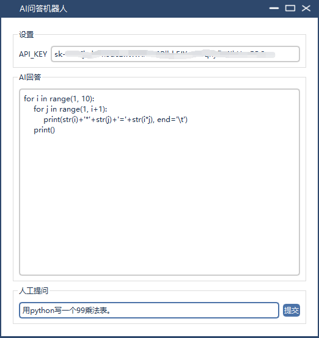

# pyqt5-chatgpt
基于chatGPT的pyqt5图形界面程序

### 界面展示

### 使用说明

API_KYE的获取需要有openai账号，然后通过以下地址获取：

https://platform.openai.com/account/api-keys

输入API_KEY,输入人工提问，点击提交。

### 联系我们

自动化测试、测试开发收徒：ck_xingchen
